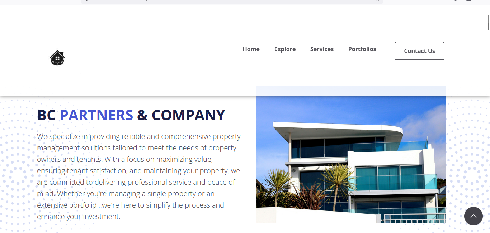

# BC Partners & Company Website

A modern, responsive website for BC Partners & Company, a professional property management firm specializing in comprehensive property services including tenant management, maintenance, financial reporting, and investment optimization.



## 🚀 Features

- **Responsive Design**: Fully responsive layout optimized for desktop, tablet, and mobile devices
- **Interactive Elements**: Custom JavaScript for animated stat counters and smooth scrolling
- **Modern UI**: Clean, professional design using Bootstrap framework
- **Contact Integration**: Functional contact form with EmailJS integration
- **Portfolio Showcase**: Dedicated sections for services, projects, and testimonials
- **Accessibility**: WCAG compliant with proper ARIA labels and semantic HTML
- **SEO Optimized**: Meta tags, structured data, and fast loading times

## 🛠️ Technologies Used

- **Frontend**: HTML5, CSS3, JavaScript (ES6+)
- **Framework**: Bootstrap 5.3
- **Icons**: Font Awesome 6
- **Styling**: SCSS (compiled to CSS)
- **Email Service**: EmailJS for contact form
- **Build Tools**: None required (static site)

## 📁 Project Structure

```text
Bc-partners-co-project/
├── index.html              # Homepage
├── article.html            # Article/Blog page
├── details.html            # Details page
├── readme.md               # Project documentation
├── requirements.txt        # Python dependencies (unused)
├── css/                    # Compiled stylesheets
│   ├── bootstrap.css
│   ├── font-awesome.css
│   └── styles.css
├── js/                     # JavaScript files
│   ├── bootstrap.bundle.min.js
│   ├── script.js
│   └── contactformtoemail.js
├── scss/                   # SCSS source files
│   ├── bootstrap.scss
│   ├── font-awesome.scss
│   └── styles.scss
├── images/                 # Images and assets
├── webfonts/               # Font Awesome fonts
└── __pycache__/            # Python cache (can be ignored)
```

## 🚀 Getting Started

### Prerequisites

- A modern web browser (Chrome, Firefox, Safari, Edge)
- Optional: Python 3.x for local server

### Running Locally

1. **Clone the repository**:

   ```bash
   git clone https://github.com/Bestboontech/Bc-partners-co-project.git
   cd Bc-partners-co-project
   ```

2. **Open directly in browser**:
   - Simply open `index.html` in your web browser

3. **Using Python server** (recommended for full functionality):

   ```bash
   python -m http.server 8000
   ```

   Then open `http://localhost:8000` in your browser

## 🎨 Customization

### Styling

- Edit SCSS files in the `scss/` directory
- Recompile using your preferred SCSS compiler (or use online tools)
- The `css/styles.css` is the compiled output

### Content

- Update text content directly in HTML files
- Replace images in the `images/` directory
- Modify contact form settings in `js/script.js`

### Email Configuration

- Update EmailJS credentials in `js/script.js` for contact form functionality
- Service ID, Template ID, and User ID need to be configured

## 📱 Responsive Design

The website is fully responsive with breakpoints for:

- Mobile: < 768px
- Tablet: 768px - 992px
- Desktop: > 992px

## 🌐 Browser Support

- Chrome (recommended)
- Firefox
- Safari
- Edge
- Internet Explorer 11+ (limited support)

## 📞 Contact

For questions or support:

- Email: `bcpartners01l@gmail.com`
- Website: [BC Partners & Company](https://bestboontech.github.io/Bc-partners-co-project/)

## 📝 License

This project is proprietary to BC Partners & Company.

## 🤝 Contributing

This is a client project. For modifications, please contact the development team.

---

## Built with ❤️ for BC Partners & Company

